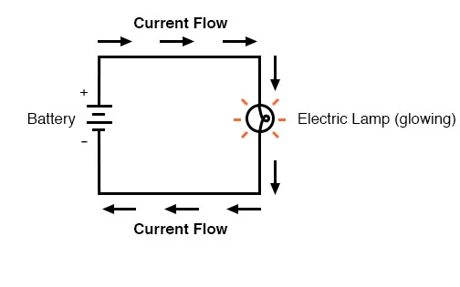

<!-- <p style="color: red; font-weight: bold">>>>>>  gd2md-html alert:  ERRORs: 0; WARNINGs: 1; ALERTS: 22.</p>
<ul style="color: red; font-weight: bold"><li>See top comment block for details on ERRORs and WARNINGs. <li>In the converted Markdown or HTML, search for inline alerts that start with >>>>>  gd2md-html alert:  for specific instances that need correction.</ul>

<p style="color: red; font-weight: bold">Links to alert messages:</p><a href="#gdcalert1">alert1</a>
<a href="#gdcalert2">alert2</a>
<a href="#gdcalert3">alert3</a>
<a href="#gdcalert4">alert4</a>
<a href="#gdcalert5">alert5</a>
<a href="#gdcalert6">alert6</a>
<a href="#gdcalert7">alert7</a>
<a href="#gdcalert8">alert8</a>
<a href="#gdcalert9">alert9</a>
<a href="#gdcalert10">alert10</a>
<a href="#gdcalert11">alert11</a>
<a href="#gdcalert12">alert12</a>
<a href="#gdcalert13">alert13</a>
<a href="#gdcalert14">alert14</a>
<a href="#gdcalert15">alert15</a>
<a href="#gdcalert16">alert16</a>
<a href="#gdcalert17">alert17</a>
<a href="#gdcalert18">alert18</a>
<a href="#gdcalert19">alert19</a>
<a href="#gdcalert20">alert20</a>
<a href="#gdcalert21">alert21</a>
<a href="#gdcalert22">alert22</a>

<p style="color: red; font-weight: bold">>>>>> PLEASE check and correct alert issues and delete this message and the inline alerts.<hr></p>
-->


# Part one - Multum in parvo - Monday

A latin saying “Multum in parvo”, much in little, conveys the main idea of the following lectures. We are going to investigate what is a microcontroller, what it consist of, what is its applications, what are difficulties of using it, what is information, what is a signal, what is a program, how to program your microcontroller and how to put all of this together to make a project that will do what you want it to do. 


## **What is a microcontroller?**

Reference: [What Is a Microcontroller? The Defining Characteristics and Architecture of a Common Component - Technical Articles (allaboutcircuits.com)](https://www.allaboutcircuits.com/technical-articles/what-is-a-microcontroller-introduction-component-characteristics-component/) 

A microcontroller is an integrated circuit (IC) device used for controlling other portions of an electronic system, usually via a microprocessor unit (MPU), memory, and some peripherals. These devices are optimised for embedded applications that require both processing functionality and agile, responsive interaction with digital (digital display), analog (temperature sensors), or electromechanical components (push buttons, rotary encoders).

The most common way to refer to this category of integrated circuits is “microcontroller" but the abbreviation “MCU” is used interchangeably as it stands for “microcontroller unit”. You may also occasionally see “µC” (where the Greek letter mu replaces “micro”).

“Microcontroller” is a well-chosen name because it emphasises defining characteristics of this product category. The prefix “micro” implies smallness and the term "controller" here implies an enhanced ability to perform control functions. As stated above, this functionality is the result of combining a digital processor and digital memory with additional hardware that is specifically designed to help the microcontroller interact with other components.


## **What makes it special and why do we use it?**

A microcontroller consists of a central processing unit (CPU), nonvolatile memory (information is stored even if the system is off), volatile 

memory (information gets lost if the system is off), peripherals, and support circuitry.


### The Central Processing Unit

The CPU performs arithmetic operations, manages data flow, and generates control signals in accordance with the sequence of instructions created by the programmer. The extremely complex circuitry required for CPU functionality is not visible to the user/person designing programs. In fact, thanks to [integrated development environments](https://www.allaboutcircuits.com/technical-articles/what-are-integrated-development-environments/) and [high-level languages such as C](https://www.allaboutcircuits.com/technical-articles/introduction-to-the-c-programming-language-for-embedded-applications/), writing code for microcontrollers is often a fairly straightforward task.


### Memory

Nonvolatile memory is used to store the microcontroller’s program—i.e., the (often very long) list of [machine-language instructions](https://www.allaboutcircuits.com/technical-articles/how-to-write-assembly-basic-assembly-instructions-ARM-instruction-set/) that tell the CPU exactly what to do. You will typically see the word “Flash” (which refers to a specific form of nonvolatile data storage) instead of “nonvolatile memory.”

Volatile memory (i.e., RAM) is used for temporary data storage. This data is lost when the microcontroller loses power. Internal registers also provide temporary data storage, but we don’t think of these as a separate functional block because they are integrated into the CPU.


### Peripherals

We use the word “peripheral” to describe the hardware modules that help a microcontroller to interact with the external system. The following bullet points identify the various categories of peripherals and provide examples.


* Data converters: analog-to-digital converter, digital-to-analog converter, reference-voltage generator
* Clock generation: [internal oscillator](https://www.allaboutcircuits.com/technical-articles/choosing-the-right-oscillator-for-your-microcontroller/), crystal-drive circuitry, [phase-locked loop](https://www.allaboutcircuits.com/technical-articles/what-exactly-is-a-phase-locked-loop-anyways/)
* Timing: general-purpose timer, real-time clock, external-event counter, [pulse-with modulation](https://www.allaboutcircuits.com/technical-articles/turn-your-pwm-into-a-dac/)
* Analog signal processing: [operational amplifier](https://www.allaboutcircuits.com/textbook/semiconductors/chpt-8/introduction-operational-amplifiers/), analog comparator
* Input/output: general-purpose digital input and output circuitry, parallel memory interface
* Serial communication: [UART](https://www.allaboutcircuits.com/technical-articles/back-to-basics-the-universal-asynchronous-receiver-transmitter-uart/), [SPI](https://www.allaboutcircuits.com/technical-articles/spi-serial-peripheral-interface/), [I2C](https://www.allaboutcircuits.com/technical-articles/introduction-to-the-i2c-bus/), [USB](https://www.allaboutcircuits.com/projects/communicating-with-an-efm8-microcontroller-via-usb/)


## **What are they used for? Where can you find them? What are scientific applications?**

Microcontrollers are used in multiple industries and applications, including in the home and enterprise, building automation, manufacturing, robotics, automotive, lighting, smart energy, industrial automation, communications and internet of things ([IoT](https://internetofthingsagenda.techtarget.com/definition/Internet-of-Things-IoT)) deployments.

The simplest microcontrollers facilitate the operation of electromechanical systems found in everyday convenience items, such as ovens, refrigerators, toasters, mobile devices, [key fobs](https://www.techtarget.com/searchsecurity/definition/key-fob), video game systems, televisions and lawn-watering systems. They are also common in office machines such as photocopiers, scanners, fax machines and printers, as well as Smart metres, ATMs and security systems.

More sophisticated microcontrollers perform critical functions in aircraft, spacecraft, ocean-going vessels, vehicles, medical and life-support systems as well as in robots. In medical scenarios, microcontrollers can regulate the operations of an artificial heart, kidney or other organs. They can also be instrumental in the functioning of prosthetic devices.

<span style="text-decoration:underline;">In scientific instruments</span>, a microcontroller  can be responsible for actuating all the peripheral objects such as a Peltier element (to heat up samples), a fan, an LED strip and so on. In <span style="text-decoration:underline;">BeeHive</span>, as you will see, the microcontroller is used for sending commands to other boards which in turn accomplish a specific goal like actuation or reading sensor.

# **Part two - By Ohm’s Law**


## **What is circuitry and what is Ohm’s Law**

[Ohm’s Law - How Voltage, Current, and Resistance Relate | Ohm's Law | Electronics Textbook (allaboutcircuits.com)](https://www.allaboutcircuits.com/textbook/direct-current/chpt-2/voltage-current-resistance-relate/)

Ohm’s principal discovery was that the amount of electric current through a metal conductor in a circuit is directly proportional to the voltage impressed across it, for any given temperature. Ohm expressed his discovery in the form of a simple equation, describing how voltage, current, and resistance interrelate:

 


$$ V = I R $$


 

In this algebraic expression, voltage (V) is equal to current (I) multiplied by resistance (R). Using algebra techniques, we can manipulate this equation into two variations, solving for I and R, respectively:

 


$$ I = {V \over R} $$  
and 
$$ R = {V \over I} $$


This might be an easier way of remembering Ohm's law.


## Analyzing Simple Circuits with Ohm’s Law

Let’s see how these equations might work to help us analyze simple circuits:

 





 

In the above circuit, there is only one source of voltage (the battery, on the left) and only one source of resistance to current (the lamp, on the right). This makes it very easy to apply Ohm’s Law. If we know the values of any two of the three quantities (voltage, current, and resistance) in this circuit, we can use Ohm’s Law to determine the third.

In this first example, we will calculate the amount of current (I) in a circuit, given values of voltage (E) and resistance (R):

 


 

What is the amount of current (I) in this circuit?

 

$$ I = {V \over R} = {12 V \over 3 \Omega} = 4 A $$


 

In this second example, we will calculate the amount of resistance (R) in a circuit, given values of voltage (E) and current (I):

 


 

What is the amount of resistance (R) offered by the lamp?

 


$$ R = {V \over I} = {36 V \over 4 A} = 9 \Omega $$


 

In the last example, we will calculate the amount of voltage supplied by a battery, given values of current (I) and resistance (R):

 


 

What is the amount of voltage provided by the battery?


$$ V = I R = (2 A )(7 \Omega) = 15 V $$


What is information? What does it consist of?

[Logic Levels - learn.sparkfun.com](https://learn.sparkfun.com/tutorials/logic-levels)

What happens is that voltage and current are not just values that are used to represent electric parameters, they can also be a source of information. For example, if we were to have a lamp and turn  it on/off constantly, it would be nothing but a signal that transmits a very simple message. This signal might be just an indicator that something works or not (lights ON - it works, lights OFF - it is turned off) or it might be something more complicated as the Morse code. To think of it, the Morse code is a structured sequence of ON/OFF signals with different time frames which, in fact, is closely correlated with the next topic of Logic levels.


## **What is a Logic Level?**

Deriving from the lamp example above, computers and microcontrollers use a communication system with only 2 states to perform all sorts of operations. In real life, this is represented as different voltage levels. We often refer to the two states in a digital circuit to be ON or OFF. Represented in binary, an ON translates to a binary 1, and an OFF translates to a binary 0. In microcontrollers, we call these signals HIGH or LOW, respectively. Using these two, digital electronic systems are able to store, process, and transmit data or information. The strength of a signal is typically described by its voltage level. How is a logic 0 (LOW) or a logic 1 (HIGH) defined? Manufacturers of chips generally define these in their spec sheets. The most common standard is TTL or Transistor-Transistor Logic, and within TTL systems, the majority of them implements LOW as 0V and HIGH as either 3.3V or 5V. 


## **Active-Low and Active-High**

When working with ICs and microcontrollers, you'll likely encounter pins that are active-low and pins that are active-high. Simply put, this just describes how the pin is activated. If it's an active-low pin, you must "pull" that pin LOW by connecting it to ground. For an active high pin, you connect it to your HIGH voltage (usually 3.3V/5V - more details on different HIGH levels below).


### TTL Logic Levels

A majority of systems we use rely on either 3.3V or 5 V TTL Levels. TTL is an acronym for Transistor-Transistor Logic. It relies on circuits built from bipolar transistors to achieve switching and maintain logic states. Transistors are basically fancy-speak for electrically controlled switches. For any logic family, there are a number of threshold voltage levels to know. Below is an example for standard 5V TTL levels:

VOH -- Minimum OUTPUT Voltage level a TTL device will provide for a HIGH signal.

VIH -- Minimum INPUT Voltage level to be considered a HIGH.

VOL -- Maximum OUTPUT Voltage level a device will provide for a LOW signal.

VIL -- Maximum INPUT Voltage level to still be considered a LOW.


You will notice that the minimum output HIGH voltage (VOH) is 2.7 V. Basically, this means that output voltage of the device driving HIGH will always be at least 2.7 V. The minimum input HIGH voltage (VIH) is 2 V, or basically any voltage that is at least 2 V will be read in as a logic 1 (HIGH) to a TTL device.

You will also notice that there is a cushion of 0.7 V between the output of one device and the input of another. This is sometimes referred to as [noise margin](http://en.wikipedia.org/wiki/Noise_margin).

Likewise, the maximum output LOW voltage (VOL) is 0.4 V. This means that a device trying to send out a logic 0 will always be below 0.4 V. The maximum input LOW voltage (VIL) is 0.8 V. So, any input signal that is below 0.8 V will still be considered a logic 0 (LOW) when read into the device.

What happens if you have a voltage that is between 0.8 V and 2 V? Well, your guess is as good as mine. Honestly, this range of voltages is undefined and results in an invalid state, often referred to as floating. If an output pin on your device is “floating” in this range, there is no certainty with what the signal will result in. It may bounce arbitrarily between HIGH and LOW.


## Bits, bytes, words

As mentioned before, using a binary system, computers and microcontrollers can communicate, store information and perform many other tasks. In this section we will explore a little on how this communication happens and how the “binary language” is organised:

[Basics of 8051 Microcontroller Programming - Gadgetronicx](https://www.gadgetronicx.com/basics-of-8051-microcontroller-programming/)


Bits are the fundamental part of information or data based on which the Microcontroller operates. The bit can take value either as 1 or 0. Bytes are defined as the collection of 8 bits. Words consist of 2 bytes or 16-bits.

Registers are small memory elements in a Microcontroller where a specific value can be loaded to perform a specific task. It can vary in size such as 8-bit or 16-bit registers.By convention, the LSB marks the initial or Least significant bit and MSB marks the last or Most significant bit.


## **Communication protocols**

Using the binary system, many different communication protocols have been created over the years, with their own advantages and disadvantages. Given the particularities of microcontrollers (limited number of IO ports, memory and processing speed), certain types of communication protocols are preferred. Below we show a couple of general characteristics present in different protocols:

[Serial Communication with Microcontrollers | Microcontroller Tutorials (teachmemicro.com)](https://www.teachmemicro.com/microcontroller-serial-communication/)

**Serial communication** is the process of transmitting data one bit at a time. In contrast, parallel communication is where data bits are sent as a whole. Parallel data transmission is faster than serial transmission but with a number of disadvantages:


* It needs more wires and therefore can be more expensive to implement
* The greater number of wires limit it to shorter transmission distances
* It is susceptible to clock skew, which limits the speed of transmission to the slowest of the links
* Crosstalk is also an issue due to the proximity of the wires

Serial data transmission answers all the above problems, most especially the first one, as cost and limited pins are common issues in microcontroller system design.

There are generally two types of serial transmission: **asynchronous** and **synchronous **which literally means “not synced” and “synced” respectively. In asynchronous data transfer, there is no clock signal for transmission and reception. The common UART (also known as RS-232 or SCI) is a device found in microcontrollers for asynchronous communication (using the serial protocol, see below - this device is also found on cars and mobile phones). There are also devices for synchronous communication, where  an extra line is added for the clock (synchronising) signal. 

The clock signal ensures that reception of correct data bits. 

For the rest of the course, serial will now refer to asynchronous data transmission used by UART devices found in Arduino and PIC microcontrollers. For the current course we won’t go into details about synchronous data transmission protocols and we refer these articles with more information about them: [SPI](https://www.teachmemicro.com/spi-primer/), [I2C](https://www.teachmemicro.com/i2c-primer/).


## The Serial Protocol

Serial communication follows a simple protocol (rules to follow) to ensure correct transmission. A serial data consists of


* Data Bits
* Synchronization Bits
* Parity Bits

The added overhead that was referred to are the synchronization (or sync) and parity bits. The sync bits are start and stop bits to indicate the start and end of transmission. When the serial bus (or data line) is idle, the voltage level goes high. The sending device sends a logic 0 (the start bit) to kickstart the transmission.

Data bits ranging from 5 to 9 bits then follow. The order of data bits is from the least significant bit (LSB) to the most significant bit (MSB).

The transmission of the parity bit, used for error checking, follows. Parity can either be even or odd. For even parity, the parity bit makes the number of 1’s even. For odd parity, the parity bit makes the number of 1’s odd.

_Example: The data bits 1010001 have three 1’s. For even parity, the parity bit should be 1 to make the total number of 1’s equal to 4 (an even number). For odd parity, the parity bit is 0 since there is already an odd number of 1’s._

Stop bits, which are one or two logic 1’s, tail the serial data, marking the end of transmission.

The baud rate, or speed of transmission, is also part of the protocol. It is important that the sender and the receiver should have the same baud rate (bits per second). The standard rates are as follows:


* 1200
* 2400
* 4800
* 9600
* 19200
* 38400
* 57600
* 115200

9600 is the most common and is the default baud rate for most serial terminals and simulators.

If you connect a serial output pin which sends a “A” (ascii 41 or 01000001 in binary) character to the oscilloscope, this is what you would see on the screen:


# Part three - Python and MicroPython


## History of Python programming

[History of Python Programming (tutorialspoint.com)](https://www.tutorialspoint.com/history-of-python-programming)

Python is a high-level, interpreted, interactive and object-oriented scripting language. Python is designed to be highly readable. It uses English keywords frequently where as other languages use punctuation, and it has fewer syntactical constructions than other languages.


* Python is Interpreted − Python is processed at runtime by the interpreter. You do not need to compile your program before executing it. This is similar to PERL and PHP.
* Python is Interactive − You can actually sit at a Python prompt and interact with the interpreter directly to write your programs.
* Python is Object-Oriented − Python supports Object-Oriented style or technique of programming that encapsulates code within objects.
* Python is great for  programming beginners due to its easy sintax, and its many libraries and users. It supports the  development of a wide range of applications from simple text processing to WWW browsers to games.

Python was developed by Guido van Rossum in the late eighties and early nineties at the National Research Institute for Mathematics and Computer Science in the Netherlands.

Python is derived from many other languages, including ABC, Modula-3, C, C++, Algol-68, SmallTalk, and Unix shell and other scripting languages.

Python is copyrighted. Like Perl, Python source code is now available under the GNU General Public License (GPL).

Python is now maintained by a core development team at the institute, although Guido van Rossum still holds a vital role in directing its progress.

Python is now one of the most used languages in the world, with many libraries that extend its functionality into many different spaces and applications. For example, there are dedicated libraries for data analysis and visualisation (Pandas, Matplotlib, seaborn), creation of graphical interfaces (tkinter), neural networks (TensorFlow), web development (Django, flask). There are too many examples to list them all here, but given that most of these libraries use the same syntax, data types object orientation from Python and are straightforward to install, it becomes clear why using Python is convenient and powerful. 

[1. What Is MicroPython? - Programming with MicroPython [Book] (oreilly.com)](https://www.oreilly.com/library/view/programming-with-micropython/9781491972724/ch01.html)

MicroPython is a full reimplementation of Python 3. Apart from some differences described in the coming paragraphs, what you know about Python also applies to MicroPython. The most obvious difference between regular Python and Micro­Python is that MicroPython is designed to work under extraordinarily constrained conditions (such as just 16 kilobytes of RAM on some of the microcontrollers (eg the micro:bit).

MicroPython runs “bare-metal” directly on the hardware: there is no underlying operating system like Windows, macOS, or Linux. All the operations and services usually provided by an operating system are handled directly by MicroPython. MicroPython has complete and direct control of the hardware, so, in effect, Micro­Python is the operating system. Apart from a few exceptions, all of the language features of Python are also in MicroPython. 

Due to the limited resources in the devices, MicroPython does not come with the full standard library by default. Rather, depending on the device, it will come with a subset of the standard library, often reimplemented in an efficient embedded-friendly manner.[5](https://www.oreilly.com/library/view/programming-with-micropython/9781491972724/ch01.html#idm140172025394240) Usually, most of the features of a module will be available, but aspects that are considered edge-cases or redundant in an embedded context will not be implemented. All versions of MicroPython come with modules for interacting with the hardware, GPIO (general-purpose input/output) pins, peripherals, and components connected via such pins.

Since MicroPython is Python 3, you get:


* Python’s style of object orientation 
* Data types (like unicode strings, integers, and floating-point numbers) and data structures (like lists, sets, and dictionaries)
* The highly dynamic nature of Python objects
* Functions as first-class objects
* Exception handling (_try_, _except_, _finally_, and the standard built-in exception classes)
* Fun features like generator functions (using the _yield_ keyword), generator expressions, and list comprehensions
* The new _async_ and _await_ keywords in the very latest versions of MicroPython
* A comprehensive number of Python’s built-in functions

Because MicroPython runs on devices with different capabilities, the availability of features and modules will sometimes be different. Of course, devices with special capabilities, like WiFi, will include modules to support these features.

For example, the micro:bit comes with a cut-down version of the standard library’s random module, but the default build for the ESP8266 board has the ultra minimalist _urandom_ module [6](https://www.oreilly.com/library/view/programming-with-micropython/9781491972724/ch01.html#idm140172025284000) instead. Because of the onboard WiFi capability, the ESP8266 port comes with both the _json_ and _urequests_ modules, whereas the micro:bit port does not because the micro:bit has no WiFi. MicroPython on both boards comes with the universally useful math module.

MicroPython’s comprehensive and flexible re-implementation of Python 3 raises three interesting opportunities:


1. The wider Python community has the opportunity to try embedded development using their favourite language.
2. Embedded developers who use C and other traditional embedded languages have the opportunity to take advantage of Python’s ease of use and rich libraries.
3. Beginner programmers have the opportunity to start with more than just “Hello, World!” They’re empowered to create engaging first projects using light, sound, sensors, and networking.

In the next section we will start showing some examples on how certain structures in programming works and how we can take advantage of them to perform complex tasks  


## If-else statement and its Python implementation

[Python if, if...else, if...elif...else and Nested if Statement (programiz.com)](https://www.programiz.com/python-programming/if-elif-else)

Decision making is required when we want to execute a code only if a certain condition is satisfied. The if…elif…else statement is used in Python for decision making.


```
if test expression:
    statement(s)
```


Here, the program evaluates the `test expression` and will execute statement(s) only if the test expression is `True`.

If the test expression is `False`, the statement(s) is not executed.

In Python, the body of the `if` statement is indicated by the indentation. The body starts with an indentation and the first unindented line marks the end.

Python interprets non-zero values as `True`. `None` and `0` are interpreted as `False`.


Fig: Flowchart of if Statement

Example: Python if Statement


```
# If the number is positive, we print an appropriate message

num = 3
if num > 0:
    print(num, "is a positive number.")
print("This is always printed.")

num = -1
if num > 0:
    print(num, "is a positive number.")
print("This is also always printed.")
```


When you run the program, the output will be:


```
3 is a positive number
This is always printed
This is also always printed.
```


In the above example, `num > 0` is the test expression.

The body of `if` is executed only if this evaluates to `True`.

When the variable `num` is equal to 3, test expression is true and statements inside the body of `if` are executed.

If the variable `num` is equal to -1, test expression is false and statements inside the body of `if` are skipped.

The `print()` statement falls outside of the `if` block (unindented). Hence, it is executed regardless of the test expression.


## Loop implementation

[Python for Loop (programiz.com)](https://www.programiz.com/python-programming/for-loop)


## The for loop in Python is used to iterate over a sequence (list, tuple, string) or other iterable objects. Iterating over a sequence is called traversal.


```
for val in sequence:
    loop body
```


Here, `val` is the variable that takes the value of the item inside the sequence on each iteration.

Loop continues until we reach the last item in the sequence. The body of for loop is separated from the rest of the code using indentation.


Fig: Flowchart of for Loop

Example: Python if Statement


```
# Program to find the sum of all numbers stored in a list

# List of numbers
numbers = [6, 5, 3, 8, 4, 2, 5, 4, 11]

# variable to store the sum
sum = 0

# iterate over the list
for val in numbers:
    sum = sum+val

print("The sum is", sum)
```


When you run the program, the output will be:


```
The sum is 48
```


## _____________________________________________


## Analog-to-digital converters

[Analogue to Digital Converter (ADC) Basics (electronics-tutorials.ws)](https://www.electronics-tutorials.ws/combination/analogue-to-digital-converter.html)

[Analog-to-Digital Converters: How Does an ADC Work? | Arrow.com | Arrow.com](https://www.arrow.com/en/research-and-events/articles/engineering-resource-basics-of-analog-to-digital-converters)

Analog-to-digital converters (ADCs) are an important component when it comes to dealing with digital systems communicating with real-time signals. With IoT developing quickly to be applied in everyday life, real-world/time signals have to be read by these digital systems to accurately provide vital information. We’ll take a dive into how ADCs work and the theory behind them.


## How ADCs Work

In the real world, analog signals are signals that have a continuous sequence with continuous values (there are some cases where it can be finite). These types of signals can come from sound, light, temperature and motion. Digital signals are represented by a sequence of discrete values where the signal is broken down into sequences that depend on the time series or sampling rate (more on this later). The easiest way to explain this is through a visual! The Figure below shows a great example of what analog and digital signals look like.


** **

Figure: A continuous signal (analog) turning into a digital signal. (Source: Waqas Akram – Quantization in ADCs)

[Microcontrollers](https://www.arrow.com/en/categories/microcontrollers-and-processors/microcontrollers) can’t read values unless it’s digital data. This is because microcontrollers can only see “levels” of the voltage, which depends on the resolution of the ADC and the system voltage.

ADCs follow a sequence when converting analog signals to digital. They first sample the signal, then quantify it to determine the resolution of the signal, and finally set binary values and send it to the system to read the digital signal. Two important aspects of the ADC are its sampling rate and resolution.


## **Sampling Rate/Frequency**

The ADC’s sampling rate, also known as sampling frequency, can be tied to the ADC’s speed. The sampling rate is measured by using “samples per second”, where the units are in SPS or S/s (or if you’re using sampling frequency, it would be in Hz). This simply means how many samples or data points it takes within a second. The more samples the ADC takes, the higher frequencies it can handle.

One important equation on the sample rate is:

$$ fs = {1 \over T} $$

Where,

$$ fs = {Sample Rate \over Frequency} $$

T = Period of the sample or the time it takes before sampling again

For example, in Figure 1, it seems fs is 20 S/s (or 20 Hz), while T is 50 ms. The sample rate is very slow, but the signal still came out similar to the original analog signal. This is because the frequency of the original signal is a slow 1 Hz, meaning the frequency rate was still good enough to reconstruct a similar signal.

“What happens when the sampling rate is considerably slower?” you might ask. It is important to know the sampling rate of the ADC because you will need to know if it will cause aliasing. Aliasing means that when a digital image/signal is reconstructed, it differs greatly from the original image/signal caused from sampling.

If the sampling rate is slow and the frequency of the signal is high, the ADC will not be able to reconstruct the original analog signal which will cause the system to read incorrect data. A good example is shown in Figure 2.


** **

Figure: An example of how aliasing happens. (Source: Tony R. Kuphaldt - Lessons in Electric Circuits)

In this example, you can see where the sampling occurs in the analog input signal. The output of the digital signal is not at all close to the original signal as the sampling rate is not high enough to keep up with the analog signal. This causes aliasing and now the digital system will be missing the full picture of the analog signal.

One rule of thumb when figuring out if aliasing will happen is using Nyquist Theorem. According to the theorem, the sampling rate/frequency needs to be at least twice as much as the highest frequency in the signal to recreate the original analog signal. The following equation is used to find the Nyquist frequency:

$$ fNyquist = 2fMax $$

Where,

$$ fNyquist = Nyquist frequency $$

fMax = The max frequency that appears in the signal

For example, if the signal that you input into the digital system has a max frequency of 100 kHz, then the sampling rate on your ADC needs to be equal or greater than 200 kS/s. This will allow for a successful reconstruction of the original signal.

It is also good to note that there are cases where outside noise can introduce unexpected high frequency into the analog signal, which can disrupt the signal because the sample rate couldn’t handle the added noise frequency. It is always a good idea to add an anti-aliasing filter ([low-pass filter](https://www.arrow.com/en/categories/amplifiers/active-filters)) before the ADC and sampling begins, as it can prevent unexpected high frequencies to make it to the system.


## **Resolution of ADC**

The ADC’s resolution can be tied to the precision of the ADC. The resolution of the ADC can be determined by its bit length. A quick example on how it helps the digital signal output a more accurate signal is shown in Figure 3. Here you can see that the 1-bit only has two “levels”. As you increase the bit length, the levels increase making the signal more closely represent the original analog signal.


Figure: Example on how resolution affects the digital signal. (Source: Apple Inc – Soundtrack Pro 3: Audio Fundamentals)

If you need accurate voltage level for your system to read, then the bit resolution is important to know. The resolution depends on both the bit length and the reference voltage. These equations help you figure out the total resolution of the signal that you are trying to input in voltage terms:

Step Size = V_Ref/N

Where,

Step Size = The resolution of each level in terms of voltage

V_Ref = The voltage reference (range of voltages)

N = Total level size of ADC

To find N size, use this equation:

N = 2<sup>n</sup>

Where,

n = Bit Size

For example, let’s say that a sine wave with a voltage range of 5 needs to be read. The ADC has a bit size of 12-bit. Plug in 12 to n on equation 4 and N will be 4096. With that known and the voltage reference set to 5V, you’ll have: Step Size = 5V/4096. You will find that the step size will be around 0.00122V (or 1.22mV). This is accurate as the digital system will be able to tell when the voltage changes on an accuracy of 1.22mV.

If the ADC was a very small bit length, let’s say only 2 bits, then the accuracy would reduce to only 1.25V, which is very poor as it will only be able to tell the system of four voltage levels (0V, 1.25V, 2.5V, 3.75V and 5V).

Figure 4 shows common bit length and their number of levels. It also shows what the step size would be for a 5V reference. You can see how accurate it gets as the bit length increases.


Figure : Bit Length and their number of levels and step size for a 5V reference range.

With understanding both the resolution and the sample rates of the ADC, you can see how important it is to know these values and what to expect from your ADC.

More information on hardware aspect of ADC can be found here: [Analogue to Digital Converter (ADC) Basics (electronics-tutorials.ws)](https://www.electronics-tutorials.ws/combination/analogue-to-digital-converter.html)

Analog to digital and digital to analog:

[https://www.electronics-tutorials.ws/combination/analogue-to-digital-converter.html](https://www.electronics-tutorials.ws/combination/analogue-to-digital-converter.html)

[https://www.arrow.com/en/research-and-events/articles/engineering-resource-basics-of-analog-to-digital-converters](https://www.arrow.com/en/research-and-events/articles/engineering-resource-basics-of-analog-to-digital-converters)


# Part Four - Tuesday


## What is timer and what is counter?

[timers.dvi (ou.edu)](https://www.cs.ou.edu/~fagg/classes/es_general/timers.pdf)

Counters, as the name suggests, are hardware mechanisms for counting some form of event. At the heart of the counter is a special purpose register that stores the current value of the counter. Any time that a certain event occurs, the value of this counter is incremented (+1 is added to the value). The type of event that causes this increment is typically configurable through other special purpose registers. Because the counter value is stored in a special purpose register, this implies that the value can also be read from or written to by the executing code. Also, different counters will store values of different sizes. The typical sizes for 8-bit microcontrollers, such as the Atmel MegaX line, are 8 and 16 bits (1 and 2 bytes). Because of this finite size, the counter can only count to a maximum value (255 for an 8-bit counter, and 65535 for a 16-bit counter). Once the counter reaches this maximum value, and a new event occurs, the counter resets back to zero. From here, the counter continues to increment with each event

In addition to counting external events, it is possible to also count events that are internal to the processor. In particular, by using the system clock (or a derivative thereof), the counter can be incremented at regular intervals. In this form, the counter becomes a form of timer. Often, the system clock is running at some “high” frequency (e.g., in our microcontrollers, we might see clocks of 16 MHz or 20 MHz). However, it is often the case that we may want our timer to count at much slower rates. This is handled in microcontrollers through the use of hardware prescalers that divide the system clock down to some reasonable frequency. Figure 3 shows the relationship between the system clock, the prescaler and the counter value. Prescalers are implemented as counters in and of themselves. Recall that if some counter is being incremented at a regular frequency, f, then bit 0 of the counter is exhibiting a regular signal at a frequency of f/2. Furthermore, bit 1 has a frequency of f/4. By “tapping into” the prescaler counter at different bits, we can divide the system clock by a range of different divisors (where the divisor takes a form of 2<sup>i</sup> for some i).

We would now like to answer questions involving the rate at which our counter is counting or the amount of time that a certain number of counts will take. In order to talk about these ideas, we first must be able to distinguish between cycles/second of the main system clock and of the prescaled signal. Here, we have artificially defined the unit of a “tick” as a single cycle of the system clock and “tock” as a single cycle of the prescaled signal. Hence, we can express prescaler values in terms of ticks per tock, i.e, how many system clock cycles compose a single prescaled cycle. Example: assume a system clock of 16, 000, 000 ticks/sec and a prescaler of 64 ticks/tock. What is the period of a single increment of the Timer 0 counter?

The answer:


$$ {64ticks/tock \over 16,000,000ticks/sec} * {1tock} = 4 \mu s $$


Example: What is the period of 250 increments of the Timer 0 counter? Answer:


$$ {64ticks/tock \over 16,000,000ticks/sec} * {250tocks} = 4 ms $$


What timers are in ESP32? (optional)


# Wednesday


## Data logging

One important thing we want to accomplish with our microcontrollers is to save the data they are collecting while performing a certain task, and given the constraints imposed by the nature of microcontrollers (memory space, communication speeds, time critical events, etc), it is a good idea to give this careful thought when designing experiments/systems.

Let’s use a practical example so that we have a better understanding of the critical points to be observed: 

The ESP32 we are using has 320kb of RAM, which can accomplish a lot, but won’t be enough for recording hours of data stream. In fact, if your system is recording data from a temperature sensor, using 12 bit resolution, you would need 2 bytes (each byte “carries” 8 bits of information) for each data point. If you would like to add information about time to each data collected, plus identify from which system the data has been collected, you would need another ~5 bytes. So every data point would be 7 bytes of information. Considering most applications will have several streams of data (temperature, humidity, triggering time of events, other sensors), and that we still have to factor in the code we write and upload to the board, this can consume all the space available in no time. Therefore, we need to find ways to “unload” data from the microcontroller’s main memory. This normally means transmitting the data to an external storage space, either an SD card, or a computer.

Data transmission can be done using serial communication. We have seen a typical communication speed of 115200 bits per second [which is equivalent to 14400 bytes/sec - 14.4kb/s], so if we want to transmit data from thetemperature sensor, above together with identifiying info, we need seven bytes per data point, plus the overhead of the communication protocol being used. Therefore in one second we can theoretically transmit ~2000 data points for temperature readings (in reality this is less as the device needs to spend time opening the communication port, sending the data, sending other check bits, etc). Another thing to observe is that the microcontroller will be busy sending out data, pretty much unable to do anything else, so we also need to be careful in observing which are appropriate moments to send/receive data.

Once the data is prepared to be transmitted out of the microcontroller, we need code on the receiving side to know what kind of data to expect, where to store it, how often, etc. 	

	


## Wednesday second part

Now we take a small break from doing and working with code, to answer possible questions you might have that have not been covered during the course.


# Thursday

BeeHive

This project started out of an interest to streamline the way we set up research systems. We needed something Open Source, modular, affordable and easy to reproduce. To avoid reinventing the wheel, we based the connectivity of BeeHive on the Grove ecosystem. Developed by Seeed Studio, Grove is an open source system with dozens of sensors and actuators. With this compatibility in place we can focus on developing modules that are not present in Grove, and add to their ecosystem at the same time. Beehive follows the principle of one function per board, and is built with Through-hole components, so that boards can be hand soldered. All documentation is already [publicly available](https://github.com/beehive-org)<span style="text-decoration:underline;">.</span>

For this part of the course we will demo an example on how beehive boards can be put together to control different systems. 

Demo: Turn on a fan with boards.

Putting boards together to do your own tasks

Show that BeeHive can be combined with Grove system through connectors and Grove modules can be used to achieve objectives that otherwise can not be completed with the current version of BeeHive. Also, point out that Beehive is an open source project so if anybody wishes, they can propose, develop and add their own stuff on top of what is already there.


# Friday

Time to sketch your own protocols! Our suggestion is to start with a mockup of your project/need, in other words, think about in general terms of steps needed to be taken for your software/project to be up and running. Example for the reaction time task we created:


1. Inter trial interval (random?)
2. LED comes on
3. Start counting time until button is pressed
4. Detect button press
5. Turn led off
6. Record time elapsed
7. Start next trial
* Take the next XX minutes to think about and write down the steps for your task.
* Now, show your sketch to the person next to you! While they are reading yours, take a moment to read theirs and make comments! Can you see if something is missing? Is there something that is not clear to you?

Time to implement your task using the training board! 


* Using the training board, start writing actual code to implement your task. Preferably, it needs to be connected to your subject area and achieve a goal that you have set. One of the most time-effective ways to do that is to write small parts of the code and test often to see if the board and code are reacting the way you would expect them to react. But first, create a sketch-diagram showing how your code is supposed to work

# Glossary

**Microcontroller** - a small computer made on an integrated circuit

**Integrated circuit** - a tiny chip that contains a lot of components (resistors, transistors, capacitors) that are all electrically connected together and work together to reach a certain goal (compare or amplify signals, rectification, etc.)

**Central processing unit** - An electronic circuit on chip which executes instructions

**Nonvolatile memory** - a type of computer memory that can retain stored information even after power is removed

**Volatile memory** - a type of computer memory that loses information after power is removed

**Internet of Things (IoT)** - Sensors, electronic devices and actuators that are comprised in one system which sends, receives and process information from the said elements with a help of network

**Shift register** - IC that allows to control multiple elements via saving the output in the register

**Logic level** - voltage value that is high enough to be recognised by a microcontroller as 1, or logic HIGH, usually 3.3 V or 5V.

**Pulse-Width Modulation (PWM)** - a signal that consist of logic HIGH and logic LOW pulses at a certain frequency. Duration of logic HIGH pulse determines PWM duty cycle which consequently is the percentage of power that the signal carries.

**Bit** - it can either be 0 or 1, a single cell that contains binary data. The fundamental piece of information storage.

**Byte** - 8 bits

**Word** - 2 bytes

**Object oriented programming** - a programming paradigm based on use of objects and classes.

**To compile code** - a compiler is a software that translates high-level programming language to machine code which can be executed

**Analog-to-digital converter **- a circuitry that recreates arbitrary analog signal with digital code, accuracy of which depends on converter’s resolution

**Baud rate **- the rate of information transmission
