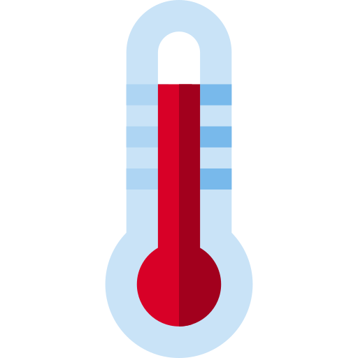
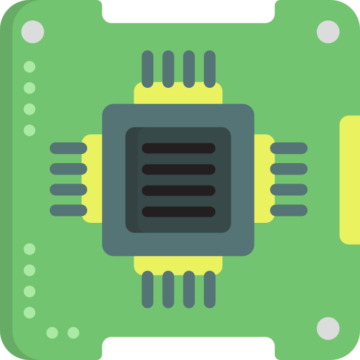

# Summary of hardware

| Hardware | Type || Function ||
 ----- | ---- | - | ----- | - |
[Main hub](https://github.com/BeeHive-org/BeeHive/wiki/Main-hub) | Control |  | Control | 
[12V5A breakout](https://github.com/BeeHive-org/BeeHive/wiki/12V5A-breakout) | Power management |  | 12V breakout | 
[5V3A breakout](https://github.com/BeeHive-org/BeeHive/wiki/5V3A-breakout) | Power management |  | 5V breakout | 
[12V/24V boost converter](https://github.com/BeeHive-org/BeeHive/wiki/Boost-converter-12V-to-24V) | Power management |  | 12V to 24V converter | 
[Gas sensor](https://github.com/BeeHive-org/BeeHive/wiki/Gas-sensor) | Sensor |  | Gas sensor | 
[H-bridge driver](https://github.com/BeeHive-org/BeeHive/wiki/H-bridge-driver) | Actuator |  | Peltier element and DC motor driver | 
[Switch array](https://github.com/BeeHive-org/BeeHive/wiki/Switch-array) | Actuator |  | Low power LEDs driver | 
[High power switch array](https://github.com/BeeHive-org/BeeHive/wiki/High-power-switch-array) | Actuator |  | High power LEDs driver | 
[Humidity and temperature sensor](https://github.com/BeeHive-org/BeeHive/wiki/Humidity-and-temperature-sensor) | Sensor |  | Humidity and temperature sensor | 
[IR sensor array](https://github.com/BeeHive-org/BeeHive/wiki/IR-sensor-array) | Actuator/Sensor |  | IR emitter and sensor | <!--  --> 
[Level shifter](https://github.com/BeeHive-org/BeeHive/wiki/Level-shifter) | Control |  | Bi-directional logic level shifter | 
[Solenoid control board](https://github.com/BeeHive-org/BeeHive/wiki/Solenoid-control-board) | Actuator |  | Solenoid | <!--   --> 
[Spike&Hold board](https://github.com/BeeHive-org/BeeHive/wiki/Spike&Hold-board) | Actuator |  | Solenoid | <!--  --> 

!!! tip
    Something useful.
